# Results
## SSL Training:
**SimCLR** model is first pre-trained for 1000 epochs. The training loss curve is:
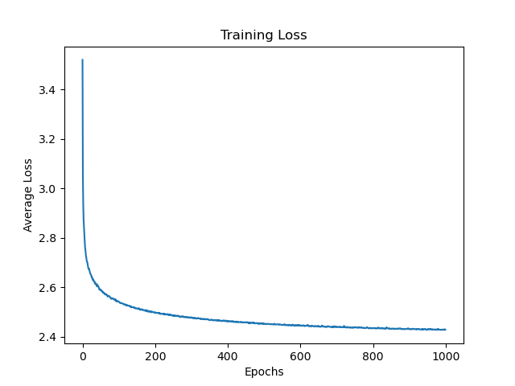

## Downstream Training:
Three experimental configurations are compared, all trained on the same SSL-pretrained encoder.

### Experiment 1: Frozen Encoder, 20 Epochs (Linear Probe)

#### Training Loss 
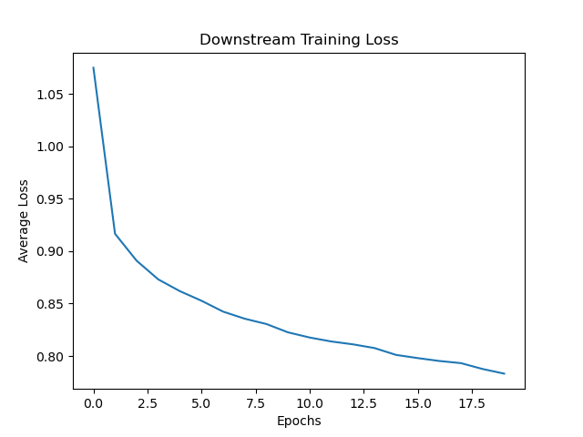

#### Confusion Matrix
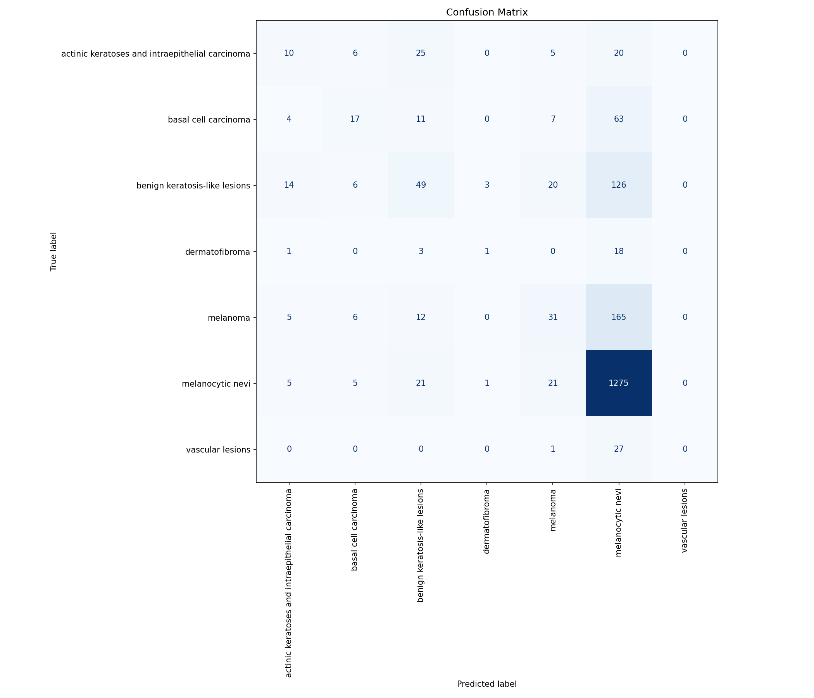

#### Classification Report
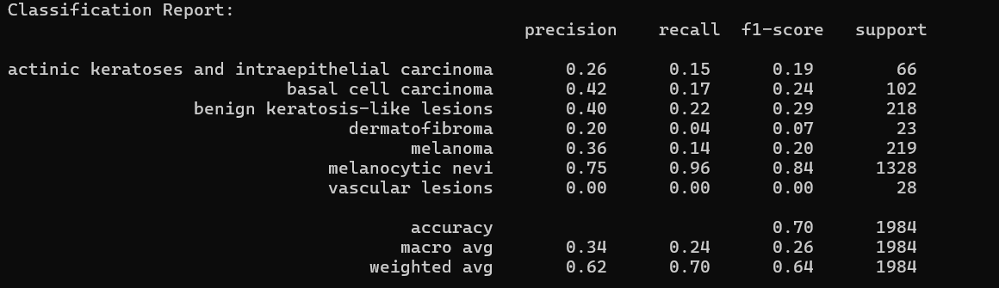

#### tSNE
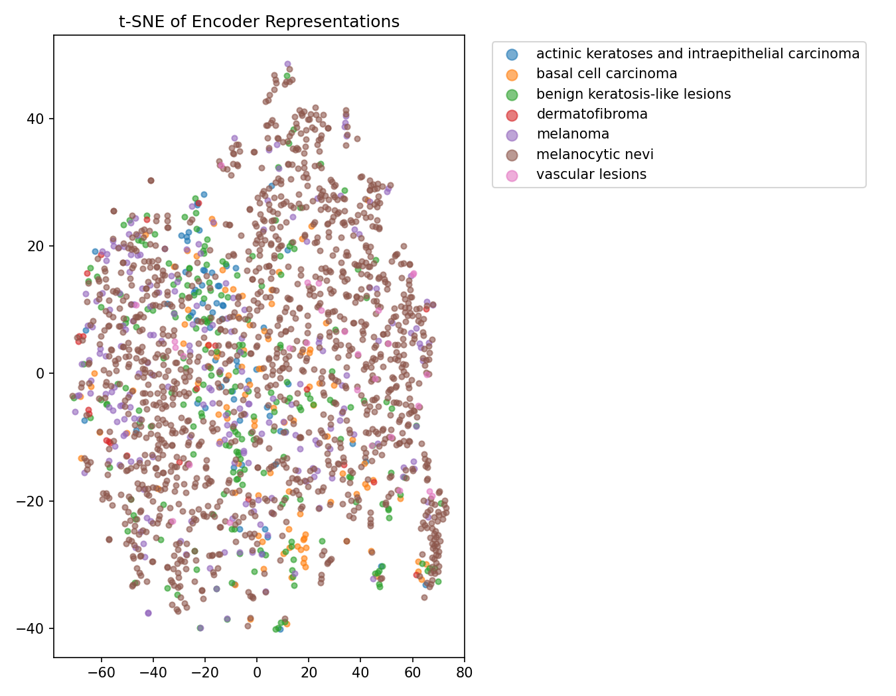

#### Observations
- Model heavily defaults to NV — 1275/1328 NV correct, but minority classes largely absorbed into NV predictions
- VASC: all 28 samples misclassified
- MEL recall at 0.14 — 165/219 melanomas missed
- t-SNE shows complete overlap with no class-discriminative structure

### Experiment 2: Unfrozen Encoder, 20 Epochs 

#### Training Loss 
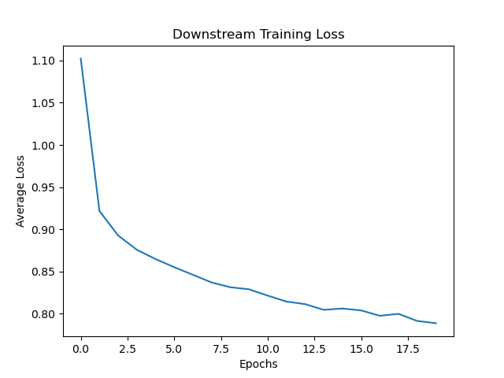

#### Confusion Matrix
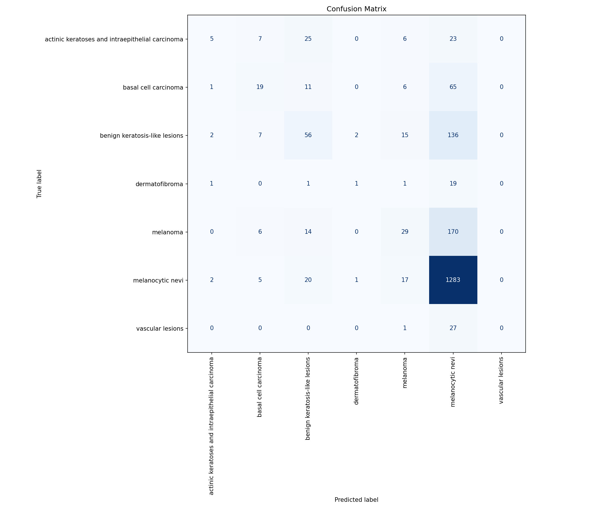

#### Classification Report
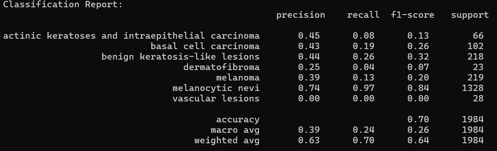

#### tSNE
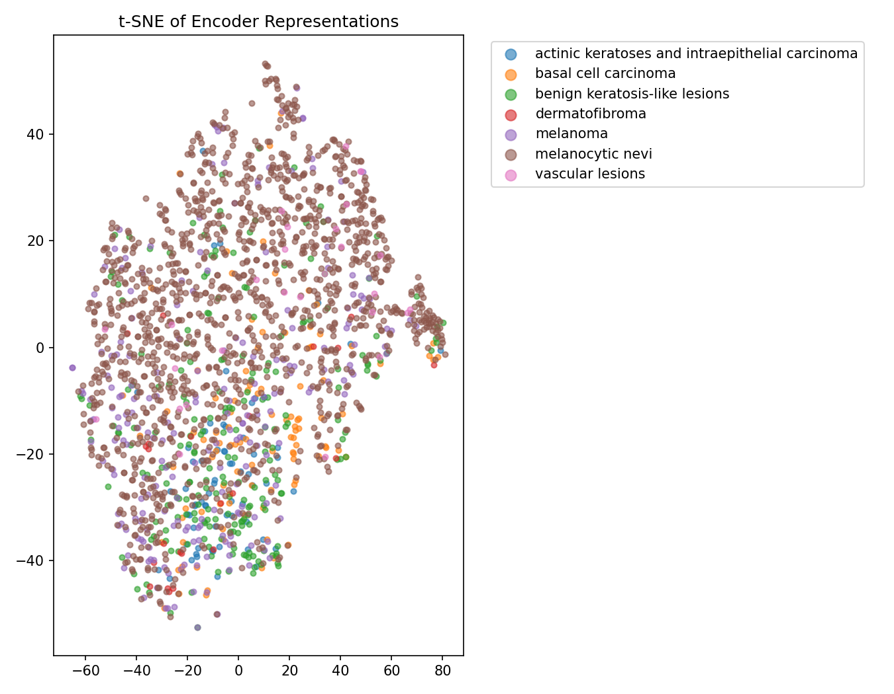

#### Observations
- Macro F1 identical to Exp 1 (0.26) despite encoder being unfrozen
- Precision improves for some classes (AKIEC: 0.26 → 0.45, MEL: 0.36 → 0.39) but recall drops — the model becomes more conservative, predicting minority classes less often and with higher confidence when it does
- NV recall increases slightly to 0.97 — unfreezing for only 20 epochs causes the encoder to overfit further toward the majority class
- t-SNE remains largely unstructured

### Experiment 3: Unfrozen Encoder, 100 Epochs 

#### Training Loss 
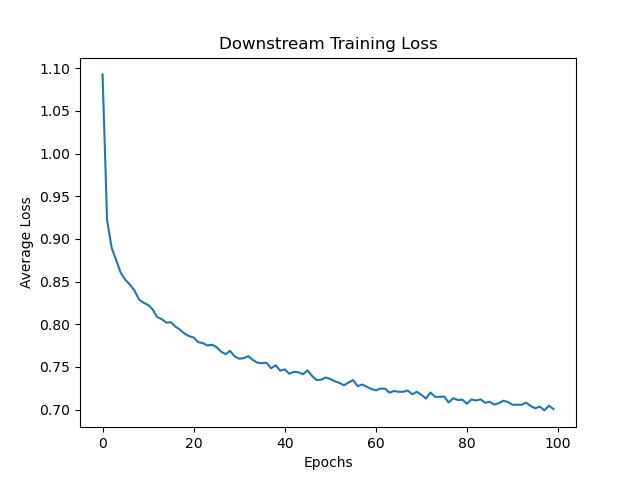

#### Confusion Matrix
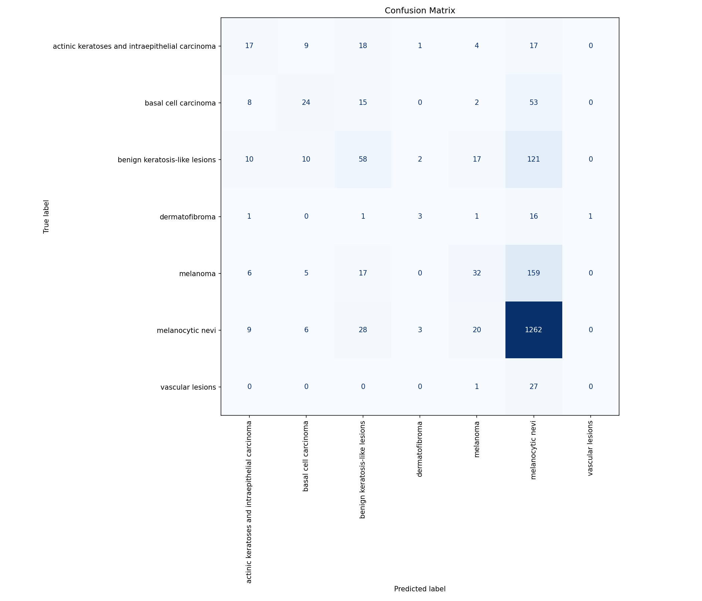

#### Classification Report 
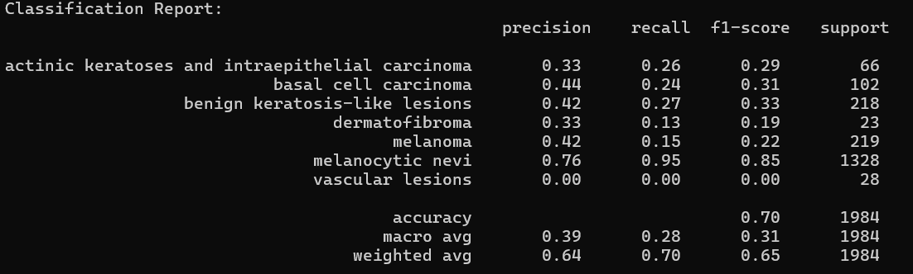

#### tSNE
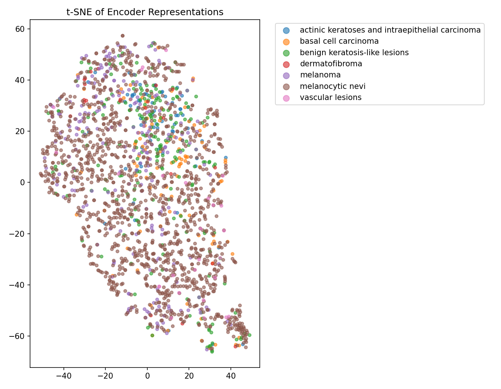

#### Observations
- **Best performing configuration** — macro F1 of 0.31, up from 0.26 in Exp 1 and 2
- Recall improves meaningfully across minority classes: AKIEC 0.15 → 0.26, BCC 0.17 → 0.24, BKL 0.22 → 0.27, DF 0.04 → 0.13
- MEL recall increases marginally to 0.15 but remains critically low
- VASC still completely undetected — too few samples for the model to learn any signal
- t-SNE shows early signs of structure — a small distinct cluster begins to emerge at the bottom right, indicating the encoder has started adapting its representations toward class-discriminative features
- NV recall drops slightly (0.96 → 0.95) — a marginal but positive redistribution toward minority classes

### Cross-Experiment Comparison

#### Macro F1 per Class

| Class | Exp 1 (Frozen, 20ep) | Exp 2 (Unfrozen, 20ep) | Exp 3 (Unfrozen, 100ep) |
|---|---|---|---|
| AKIEC | 0.19 | 0.13 | **0.29** |
| BCC | 0.24 | 0.26 | **0.31** |
| BKL | 0.29 | 0.32 | **0.33** |
| DF | 0.07 | 0.07 | **0.19** |
| MEL | 0.20 | 0.20 | **0.22** |
| NV | **0.84** | **0.84** | 0.85 |
| VASC | 0.00 | 0.00 | 0.00 |
| **Macro Avg** | 0.26 | 0.26 | **0.31** |

## Key Takeaways

- Unfreezing the encoder alone (Exp 2) does **not** help — 20 epochs is insufficient for the encoder to meaningfully adapt, and precision/recall trade-offs cancel out
- Extended fine-tuning (Exp 3) is the only configuration that shows genuine improvement in minority class recall
- VASC is unlearnable across all configurations — 28 test samples is simply not enough signal
- MEL recall remains dangerously low (~0.13–0.15) across all runs — the dominant bottleneck is data imbalance, not training strategy
